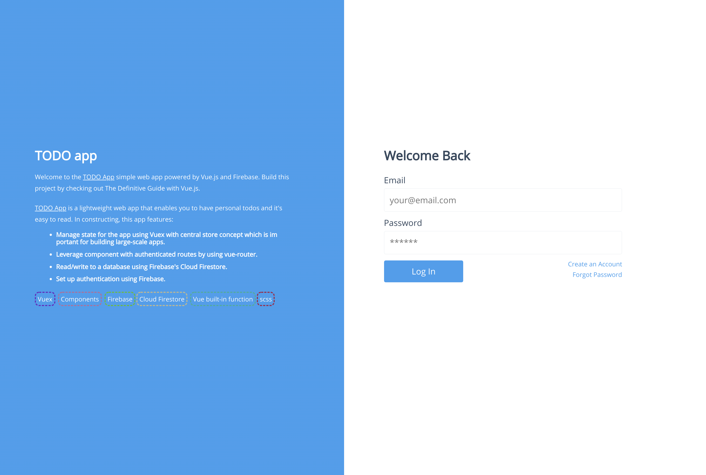
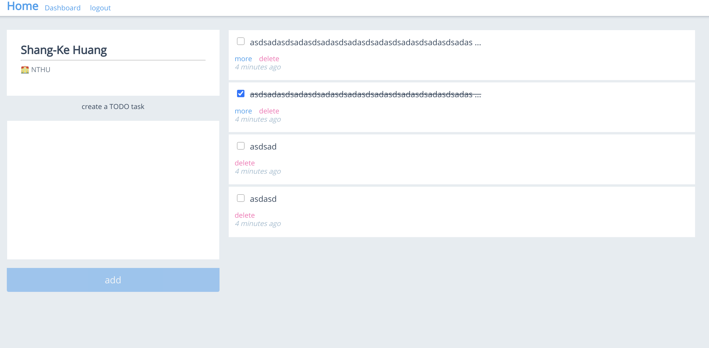

# TODO List app

Table of Contents
- [TODO List app](#todo-list-app)
  - [About](#about)
  - [Get Started](#get-started)


## About
[TODO App](https://twcamel.github.io/TODO-app/) simple web app powered by Vue.js and Firebase. Build this project by checking out The Definitive Guide with Vue.js.




This app is featured by: 

- Vuex to efficiently centrally manage data 
- Componentes for update/render DOM
- Firebase SDK to set and get data
- SCSS for structural customize style
- Travis CI for automatic updates

## Get Started
```
# pull from this repo
git clone https://github.com/TWcamel/TODO-app.git

# install dependencies
npm i

# go to firebase.js and add your personal setting
# more info see below firebase doc 
# https://firebase.google.com/docs?authuser=0 

# start local server @ localhost:8080 and have fun!
npm run serve

```